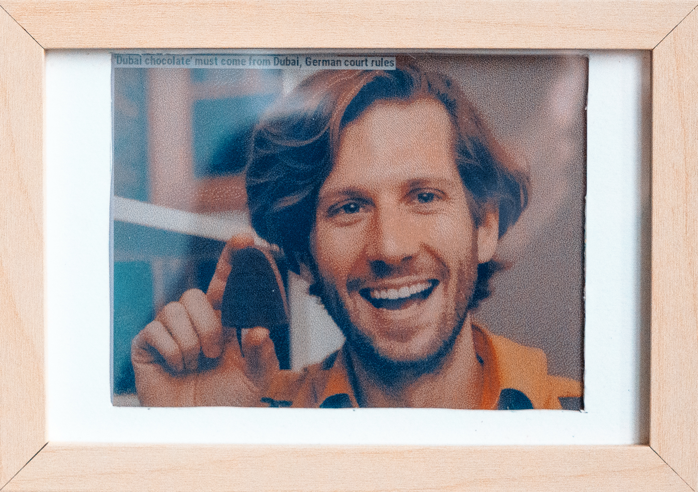

+++
title = "meInk News"
date = "2025-01-12"
author = "Marco Szeidenleder"
description = "A picture frame that automatically gets a news headline every day and creates a picture of myself within these news"
tags = ["art", "eink", "genai"]
+++

Why?!, you might ask. But that's not the point here. I have always been a huge fan of eInk/ePaper, and I am waiting for the day when they will finally pick up as a calm way to present information and be used for business as a means to display dashboards. 
I've put an old raspberry pie and an [eInk display from Pimoroni](https://shop.pimoroni.com/products/inky-impression-7-3?variant=40512683376723) into a picture frame. Now, every morning, I wake up to a new picture of myself, within a scene representing one headline of the latest news.