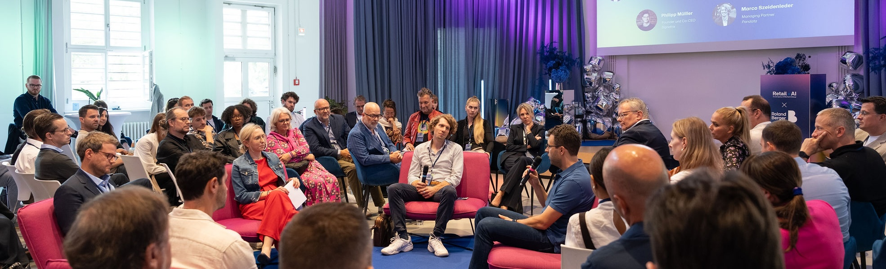

+++
title = 'Speaker'
date = 2025-11-11T12:14:52+02:00
draft = false
+++

 

I regularly speak at conferences, corporate events, and workshops across Europe on AI strategy, data infrastructure, and practical implementation. Below you'll find my current talk portfolio – from keynotes to hands-on sessions.

[Download](speakerkit.zip) my speaker kit with photos and bio or get in touch directly.

# Talks in German or [English](englishtalks):

## **"Von der Vision zur Umsetzung: AI Use Cases finden, die wirklich funktionieren"**

**Dauer:** 45 Minuten | **Format:** Keynote + Interactive Session

**Beschreibung:**  
Die meisten KI-Projekte scheitern nicht an der Technologie, sondern an schlecht definierten Use Cases. In diesem Vortrag zeige ich den bewährten Pandata AI Innovation Canvas – ein Framework, das aus über 50 Projekten entstanden ist. Wir durchlaufen gemeinsam den Prozess von der Problemdefinition über Datenquellen-Check bis zur Machbarkeitsbewertung. 

**Teilnehmer lernen:**
- Wie man echte Business-Probleme von "KI-Hype" unterscheidet
- Den 8-Schritte-Canvas zur systematischen Use Case Entwicklung
- Welche Fragen vor jedem KI-Projekt beantwortet sein müssen
- Praktische Red Flags: Wann sollte man NICHT mit KI starten

**Zielgruppe:** C-Level, Produktmanager, Innovation Teams  
**Takeaway:** Canvas-Prozess für eigene Use Case Exploration

---

## **"AI-Ready in 90 Tagen: Die Data Foundation für erfolgreiche KI-Projekte"**

**Dauer:** 40 Minuten | **Format:** Technical Deep-Dive

**Beschreibung:**  
"Wir haben keine Daten" ist die häufigste Ausrede für gescheiterte AI-Initiativen. Die Wahrheit: Die meisten Unternehmen haben Daten – sie sind nur nicht zugänglich, strukturiert oder dokumentiert. Dieser Vortrag zeigt den pragmatischen Weg von chaotischen Datensilos zu einer KI-fähigen Infrastruktur – ohne jahrelange Data-Warehouse-Migration.

**Teilnehmer lernen:**
- Das 4-Layer-Modell: Raw → Clean → Object → Reporting
- Use-Case-Driven Development statt Big Bang Approach
- Wie man mit dem Query Pilot in Tagen statt Monaten produktiv wird
- Vendor-agnostische Architektur-Patterns für RAG & Agentic AI

**Zielgruppe:** CDOs, CTOs
**Takeaway:** Checkliste "AI Data Readiness Assessment" + Architektur-Blueprint

---

## **"Effizienz neu gedacht: Prozessoptimierung mit KI – aber richtig"**

**Dauer:** 35 Minuten | **Format:** Case Study Showcase

**Beschreibung:**  
KI für Prozessoptimierung klingt verlockend – aber wann macht "Make" Sinn und wann sollte "Buy"? Anhand konkreter Beispiele aus unserem Portfolio (Support-Automatisierung mit RAG, Budget-Allokation, Pricing-Optimierung) zeige ich, wie man den ROI maximiert und typische Fallen vermeidet. Spoiler: Nicht jeder Prozess braucht ein Custom-LLM.

**Teilnehmer lernen:**
- Die Make-vs-Buy-Matrix für KI-Lösungen
- Wann Agentic AI sinnvoll ist (und wann nicht)
- Wie man Quick Wins identifiziert und skaliert
- Realistische Erfolgsmetriken jenseits von "AI-Washing"

**Zielgruppe:** CPOs, CSOs, Fachbereichsleiter, Prozessverantwortliche  
**Takeaway:** Decision Framework "AI Process Optimization Canvas"

---

## **"Chat with your Data Warehouse: LLMs als neue BI-Schnittstelle"** 

**Dauer:** 30 Minuten | **Format:** Live Demo + Technical Talk

**Beschreibung:**  
SQL-Kenntnisse als Voraussetzung für Datenanalyse? Das war gestern. Mit dem Query Pilot zeige ich live, wie Sprachmodelle zur natürlichen Schnittstelle ins Data Warehouse werden – 100% datenschutzkonform durch ausschließliche Metadaten-Nutzung. Ein Game-Changer für Data Democratization.

**Teilnehmer lernen:**
- Wie Text-to-SQL in der Praxis funktioniert (inkl. Limitations)
- RAG-Architektur für strukturierte Daten
- Privacy-by-Design: Metadaten vs. Actual Data
- Integration in bestehende BI-Landschaften

**Zielgruppe:** Data Leads, BI-Teams, CDOs  
**Takeaway:** Live-Demo des Query Pilots + Technical Architecture Guide

