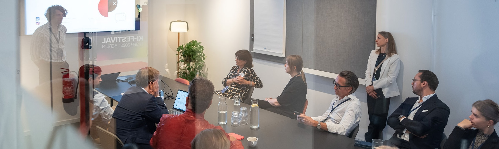

+++
title = 'Talks in English'
date = 2025-11-11T12:14:52+02:00
draft = false
+++

## **"From Vision to Implementation: Finding AI Use Cases That Actually Work"**
**Duration:** 45 minutes | **Format:** Keynote + Interactive Session

**Description:**  
Most AI projects don't fail because of technology – they fail because of poorly defined use cases. In this talk, I present the proven Pandata AI Innovation Canvas – a framework developed from over 50 projects. We'll walk through the entire process together, from problem definition and data source validation to feasibility assessment.
**Attendees will learn:**
- How to distinguish real business problems from "AI hype"
- The 8-step Canvas for systematic use case development
- Which questions must be answered before any AI project
- Practical red flags: When you should NOT start with AI
**Target audience:** C-Level, Product Managers, Innovation Teams  
**Takeaway:** Canvas process for your own use case exploration
---
## **"AI-Ready in 90 Days: Building the Data Foundation for Successful AI Projects"**
**Duration:** 40 minutes | **Format:** Technical Deep-Dive

**Description:**  
"We don't have data" is the most common excuse for failed AI initiatives. The truth: Most companies have data – it's just not accessible, structured, or documented. This talk shows the pragmatic path from chaotic data silos to an AI-ready infrastructure – without years-long data warehouse migrations.
**Attendees will learn:**
- The 4-layer model: Raw → Clean → Object → Reporting
- Use-Case-Driven Development instead of Big Bang Approach
- How to become productive in days rather than months with Query Pilot
- Vendor-agnostic architecture patterns for RAG & Agentic AI
**Target audience:** CDOs, CTOs
**Takeaway:** "AI Data Readiness Assessment" checklist + Architecture Blueprint
---
## **"Rethinking Efficiency: Process Optimization with AI – Done Right"**
**Duration:** 35 minutes | **Format:** Case Study Showcase

**Description:**  
AI for process optimization sounds appealing – but when does "Make" make sense and when should you "Buy"? Using concrete examples from our portfolio (support automation with RAG, budget allocation, pricing optimization), I show how to maximize ROI and avoid common pitfalls. Spoiler: Not every process needs a custom LLM.
**Attendees will learn:**
- The Make-vs-Buy matrix for AI solutions
- When Agentic AI makes sense (and when it doesn't)
- How to identify and scale quick wins
- Realistic success metrics beyond "AI-washing"
**Target audience:** CPOs, CSOs, Department Heads, Process Owners  
**Takeaway:** Decision Framework "AI Process Optimization Canvas"
---
## **"Chat with Your Data Warehouse: LLMs as the New BI Interface"** 
**Duration:** 30 minutes | **Format:** Live Demo + Technical Talk

**Description:**  
SQL knowledge as a prerequisite for data analysis? That's yesterday's thinking. With Query Pilot, I demonstrate live how language models become a natural interface to your data warehouse – 100% privacy-compliant through exclusive use of metadata. A game-changer for data democratization.
**Attendees will learn:**
- How text-to-SQL works in practice (including limitations)
- RAG architecture for structured data
- Privacy-by-Design: Metadata vs. actual data
- Integration into existing BI landscapes
**Target audience:** Data Leads, BI Teams, CDOs  
**Takeaway:** Live demo of Query Pilot + Technical Architecture Guide